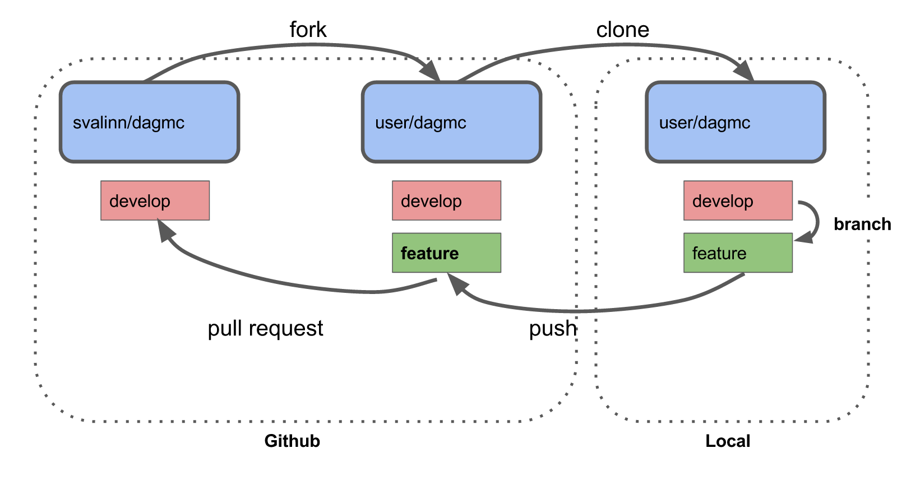
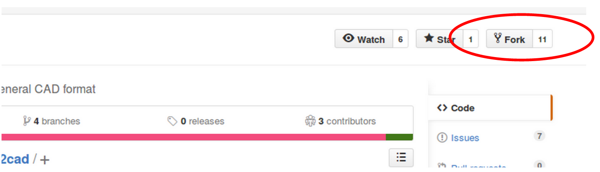
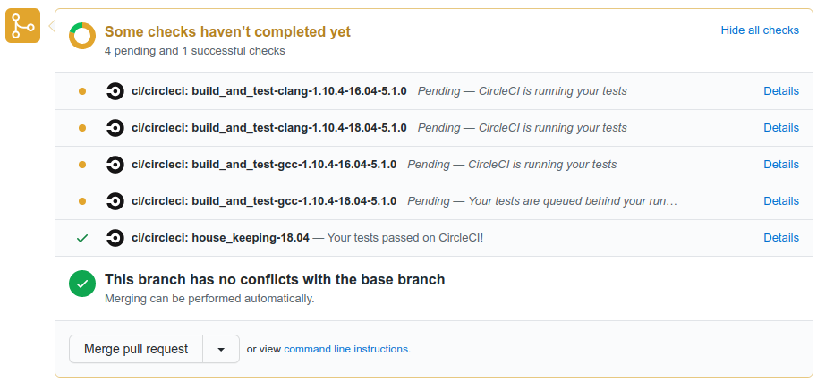
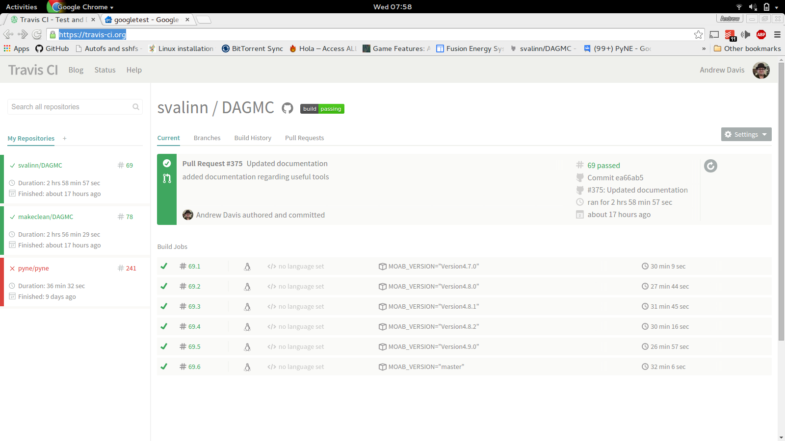

Contributors guide
==================

DAGMC is an open source project that facilitates the running of CAD based particle transport problems.

Contributing
~~~~~~~~~~~~

Contributing to the DAGMC project is very straightforward, DAGMC is hosted on Github where issues and pull requests are
discussed and merged. We use the git version control system which could be the most unfamiliar aspect of contributing for
most people. The general workflow to contribute to DAGMC and many other open source projects involves steps like below.

There are 6 main steps:

    1. Forking
    2. Cloning
    3. Branching
    4. Pushing
    5. Pull Requesting
    6. Refresh your branch

These stages are outlined below.

Forking
-------

To start the repository must be forked. The easiest way to do this is to click on the
`fork` button from the `svalinn/dagmc` branch shown below.

This fork will be an exact snapshot of the `svalinn/dagmc` repository at the time you clicked `fork`. Any new features
that you wish to develop should be based from the develop branch of this repository, unless you know exactly what you're
doing.

Cloning
-------

You should now clone your fork of this repository to your local machine
::

    $ git clone https://github.com/githubusername/dagmc
    $ cd dagmc

It is prudent to also add the main svalinn repository as another remote source
::

    $ git add remote upstream https://github.com/svalinn/dagmc

Branching
---------

The base level of the repository contains folders for each of the supported Monte Carlo codes, the tools directory, and our
amalgamated PyNE build. First, you need to checkout a new branch in which to keep your changes.
::

    $ git checkout -b "my_feature_branch"

To insert a new feature edit an existing file or add new ones as required, remember to update the
CMakeList.txt files as required. Your new changes need to be added, commited and pushed.
::

    $ git add <files needed to add>
    $ git commit -m "This is a message that describes why we need these changes"

Pushing
-------

Now that your changes are commited, you push the changes to your remote branch in your clone of DAGMC
::

    $ git push origin my_feature_branch

Before pushing your local feature branch is the only place this changeset is stored. In order to let your
remote repository know of these changes you have to push.

Pull Requesting
---------------

Having succesfully pushed your changes to your remote fork you can carry on and make more changes or create a pull request from
the changes you have made. If you immediately go to your fork on Github you should see a message offering to create a pull
request with that branch to `svalinn/dagmc:develop`, if you click this message you can edit and submit the pull request. If
you've waited a few tens of minutes between pushing and going to Github you may have to manually create a pull request. Your
pull request will launch our continuous integration tests and at some point in the near future your changes will pass all
the unit tests or indeed may break the tests. Testing in progress and testing complted are shown at the bottom of your pull
request.

When testing passes and another developer has reviewed your pull request, then your changes will be merged into the develop branch.

Refreshing your branch
----------------------

It should be noted that having had your pull request successfully integrated into the DAGMC mainline develop branch, your
clone and your local repositories develop branch will reflect the pre-pull request state of DAGMC. In order for your personal
clones and repositories to be updated, you must first pull the develop changes into your local clone;
::

    $ git checkout develop #remember to checkout the develop branch!
    $ git pull upstream develop

Now your local clone of the repository has an up-to-date develop branch, but you still need to refresh your Github branch, and now
you must push the develop changes up to it
::

    $ git push origin develop

Testing & Continuous Integration
~~~~~~~~~~~~~~~~~~~~~~~~~~~~~~~~

We use the `Google Test <https://code.google.com/p/googletest/>`_ gtest libraries to control testing of our code and we
use the `Travis <https://travis-ci.org/>`_ continuous integration system to test all changes to the code. When you add
features to the codebase, tests should always be added which prove the capabilities that have been added.

When a developer
makes a pull request on GitHub, Travis detects this change and launches the build as specified in the .travis.yml file. Travis
pulls your feature branch, the MOAB libraries, HDF5, etc as required and then launches the tests. Each test is run in succession
and failure is reported if any dependency fails to build or if any test fails, an example of a Travis report is shown below

Once the testing is complete and your changes have been verified to not break any of the existing capabilities, a reviewer will check
your pull request over and may suggest some modifications to meet the C++ style, good practice and then will approve or reject your
pull request.

General Style
~~~~~~~~~~~~~

Explicit namespacing is preferred, so rather than using the `using namespace xxx` command, you should prefix the variable with the
class name, i.e.
::

    pyne::Material new_material; // this is a new material

is preferred over,
::

    using namepspace pyne;
    Material new_material; // this is a new material

This is to save developers pouring over potentially 20 different header files trying to isolate exactly which type this should
be.

C++ Style
~~~~~~~~~

We conform to the Google C++ style guide, we have included a C++ style guide formatter to make a developers life much easier,
when you have added all the features you want to add, the style guide formatter should be run;
::

    $ astyle --style=linux --indent=spaces=2

Then commit the changes to your branch. Avoid commiting code only changes and then commiting C++ formatter changes, as the
changeset is very hard to review.

Bug Reporting
~~~~~~~~~~~~~

If you find a bug, raise an issue on the main `svalinn/dagmc <https://github.com/svalinn/DAGMC/issues>`_ Github site. If you
think you can tackle the issue then please do, then pull request your changes.
