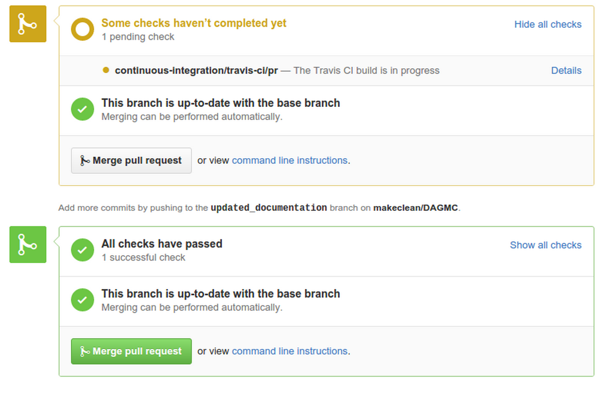

Contributors guide
==================

DAGMC is an open-source project that facilitates the running of CAD-based
particle transport problems.

Contributing
~~~~~~~~~~~~

Contributing to the DAGMC project is very straightforward. DAGMC is hosted on
`Github <DAGMC_source_>`_ where issues and pull requests are discussed and
merged. We use the git version control system, which could be the most
unfamiliar aspect of ontributing for most people. The general workflow to
contribute to DAGMC and many other open source projects involves steps like
this.

There are 6 main steps:

    1. Forking
    2. Cloning
    3. Branching
    4. Pushing
    5. Pull requesting
    6. Refreshing your branch

These stages are outlined below.

Forking
-------

To start the repository must be forked. The easiest way to do this is to click
on the "Fork" button from the `svalinn/DAGMC` branch shown below.

This fork will be an exact snapshot of the `svalinn/DAGMC` repository at the
time you clicked "Fork". Any new features that you wish to develop should be
based from the develop branch of this repository, unless you know exactly what
you're doing.

Cloning
-------

You should now clone your fork of this repository to your local machine.
::

    $ git clone https://github.com/<githubusername>/DAGMC
    $ cd DAGMC

It is prudent to also add the main svalinn repository as another remote source.
::

    $ git add remote upstream https://github.com/svalinn/DAGMC

Branching
---------

The base level of the repository contains folders for each of the supported
Monte Carlo codes, the tools directory, and our amalgamated PyNE build. First,
you need to checkout a new branch in which to keep your changes.
::

    $ git checkout -b "my_feature_branch"

To insert a new feature, edit an existing file or add new ones as required.
Remember to update the ``CMakeList.txt`` files as required. Your new changes
then need to be added, commited, and pushed.
::

    $ git add <files needed to add>
    $ git commit -m "This is a message that describes why we need these changes"

Pushing
-------

Now that your changes are commited, push the changes to your remote branch in
your clone of DAGMC.
::

    $ git push origin my_feature_branch

Before pushing, your local feature branch is the only place this changeset is
stored. Pushing is required in order to let your remote repository know of these
changes.

Pull requesting
---------------

Having succesfully pushed your changes to your remote fork, you can carry on and
make more changes, or create a pull request from the changes you have made. If
you immediately go to your fork on Github, you should see a message offering to
create a pull request with that branch to `svalinn/DAGMC:develop`. If you click
this message you can edit and submit the pull request. If you've waited a few
tens of minutes between pushing and going to Github, you may need to create a
pull request manually. Your pull request will launch our continuous integration
tests, and after a short while, your changes will either pass all the tests or
fail the some of them. The status of the tests is shown at the bottom of the
pull request.

When testing passes and another developer has reviewed your pull request, your
changes will then be merged into the develop branch.

Refreshing your branch
----------------------

Once your pull request has been integrated into the mainline DAGMC develop
branch successfully, your clone and your local repository's develop branch will
reflect the pre-pull request state of DAGMC. In order for your personal clones
and repositories to be updated, you must first pull the changes into your local
clone.
::

    $ git checkout develop #remember to checkout the develop branch!
    $ git pull upstream develop

Now your local clone of the repository has an up-to-date develop branch, but you
still need to refresh your Github branch, and now you must push the develop
changes to it.
::

    $ git push origin develop

Testing and continuous integration
~~~~~~~~~~~~~~~~~~~~~~~~~~~~~~~~~~

We use the `Google Test <Google_test_>`_ gtest libraries to control testing of
our code, and we use the Travis_ continuous integration system to test all
changes to the code. When you add features to the codebase, tests should always
be added which prove that the capabilities that have been added work.

When a developer makes a pull request on GitHub, Travis detects it and launches
the build as specified in the ``.travis.yml`` file. Travis pulls your feature
branch, the MOAB libraries, HDF5, etc. as required and then launches the tests.
Each test is run in succession and failure is reported if any dependency fails
to build or if any test fails. An example of a Travis report is shown below.

Once the testing is complete and your changes have been verified as not breaking
any of the existing capabilities, a reviewer will check your pull request over
and may suggest some modifications and then will approve or reject your pull
request.

General style
~~~~~~~~~~~~~

Explicit namespacing is preferred, so rather than using the
`using namespace xxx` command, you should prefix the variable with the class
name. For example,
::

    pyne::Material new_material; // this is a new material

is preferred over
::

    using namepspace pyne;
    Material new_material; // this is a new material

This is to save developers poring over dozens of different header files trying
to isolate exactly which type is being referenced.

C++ Style
~~~~~~~~~

DAGMC conforms to the Google C++ style guide, and we have included a C++ style
guide formatter to make developers' lives much easier. When you have added all
the features you want to add, the style guide formatter should be run.
::

    $ astyle --style=linux --indent=spaces=2

Then commit the changes to your branch. Avoid commiting code only changes and
then commiting C++ formatter changes, as this makes the changeset more difficult
to review.

Bug reporting
~~~~~~~~~~~~~

If you find a bug, raise an issue on the main `svalinn/DAGMC <DAGMC_issues_>`_
Github site. If you think you can tackle the issue yourself then please do so,
then pull request your changes.

..  _DAGMC_source: https://github.com/svalinn/DAGMC
..  _DAGMC_issues: https://github.com/svalinn/DAGMC/issues
..  _Google_test: https://code.google.com/p/googletest
..  _Travis: https://travis-ci.org/svalinn/DAGMC
