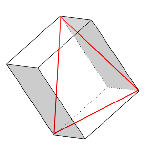
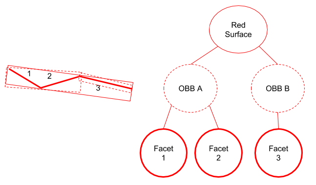
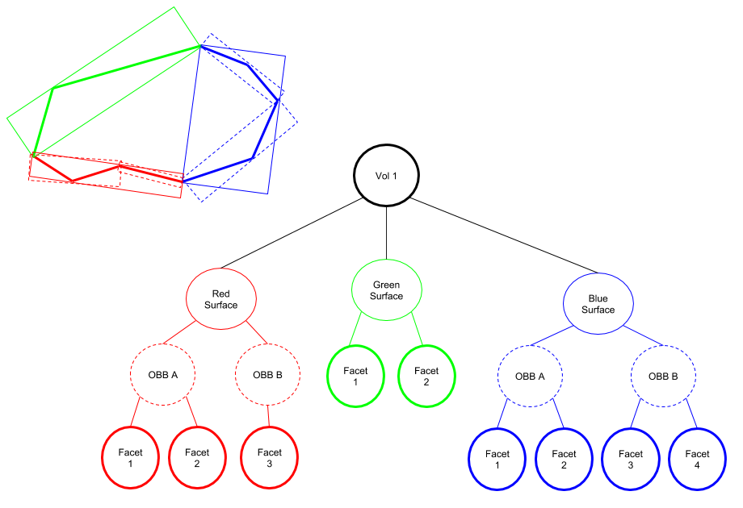

Developer's Theory Guide
========================

This guide is meant to give developers a comprehensive understanding of how
DAGMC works as it exists in MOAB and the key components one may use during
development.

Constructor
~~~~~~~~~~~~

To initialize a DAGMC instance, the constructor must be called. If the
constructor is called with no arguments, then a new MOAB instance is created
with an attached DAGMC instance.
Otherwise, a pointer to an existing MOAB instance can be passed in the
constructor and a DAGMC instance will be attached to that existing MOAB instance.

DAGMC Setup
~~~~~~~~~~~~

There are three main steps to setting up a DAGMC geometry. First the storage
space for the implicit complement is created. Then the OBB trees are built.
And finally the sets of indices for volumes and surfaces are generated.
See sections below for more information about implicit complements, OBBs,
and indices.

Topology
--------

Every geometry contains entities that are either volumes, surfaces, or curves.
There are two types of relationships that can relate entities to other entities.
The first is called a parent-child relationship. Volumes are parents to surfaces
that make up that volume; surfaces are parents of of curves; and curves are
parents to the geometric vertices of that curve.

The second type of relationship is the set relationship, which is different
from a parent-child relationship. Each surface and curve has an entity set.
The entity set for a surface contains the triangles and their vertices for that
surface. Curves contain edges and their vertices. The entity set for a volume,
however, is empty. While a volume is made of surfaces (the parent-child
relationship), the volume does not contain an entity set.

Sense Tags
----------

Each surface is tagged with the two volume handles of the adjacent volumes.
The first of the two surfaces is designated as the forward direction and the
second is designated with the reverse direction. It is important to note that
these surfaces senses may not be consistent with how an MC code determines
the surface sense.

Indices
~~~~~~~

Types of Indices
----------------

There are three ways to identify any surface and volume in a geometry:
global ID, index, or entity handle. The global ID is an integer number that
corresponds to the Cubit ID. As a result, the set of global IDs does not
necessarily have to be contiguous. During setup, the global ID is tagged on the
entity set. The second method is to identify by index. This is an ordinal
numerical reference for each volume or surface in the geometry. The third method
is to identify by the entity handle of the entity set. The entity handle is
assigned by MOAB and is not necessarily contiguous.

Cross Referencing
-----------------

If one type of index is known, then either of the other two can be determined.
By using the functions below or a combination of the functions, either global ID,
index, or entity handle can be determined. It is important to note that surfaces
and volumes each have their own set of integer indexes and global IDs, while
entity handles are unique to each entity set. Each integer (whether it is an
index or global ID) can refer to multiple entity handles (a surface or volume).
Therefore, when cross referencing by either index or global ID, the dimension
needs to be supplied, but is not necessary when cross referencing by entity
handle. There are five methods for cross referencing: entity handle by index
(``entity_by_index``), global ID by index (``id_by_index``), entity handle by global
ID (``entity_by_id``), global ID by entity handle (``get_entity_id``), index by entity
handle (``index_by_handle``).

OBB Tree
~~~~~~~~

What is an OBB?
---------------

An OBB, or Oriented Bounding Box, is a box that contains a single facet or set
of facets and has an axis oriented such that it is the smallest possible box
encompassing the facet(s), as opposed to having an axis aligned with the full geometry.
This is different from an axis aligned bounding box,
which is aligned with the global axis and is not necessarily the smallest box
possible. An example is the facet outlined in red below and it’s corresponding
OBB. For the the rest of this section, facets will be represented by a line with
a 2D OBB.

OBB Tree Construction
---------------------

First, the OBB tree for each surface is built. This is built top down where the
top level is an OBB that contains all the surface’s facets. Then the set of facets
is split roughly in half and two new OBBs form around each of the new sets.
This continues until each of the OBBs the level contains a small number of facets. A 2D
example is given below where a single surface has been faceted and the
corresponding OBB tree is created.

After OBB trees have been created for each surface in a geometry, they are
joined together to create a complete OBB tree for a volume. See the example
below where the green, red, and blue surfaces make up a volume.

Implicit Complement
~~~~~~~~~~~~~~~~~~~

What is the Implicit Complement & How is it formed?
---------------------------------------------------

The implicit complement is the space not defined by the CAD model. It is formed
by looking at the sense(s) of each surface individually. A surface between two
volumes has both a forward and reverse sense defined with respect to the
volumes. A surface that has only one sense defined, whether it is forward or
reverse, means that only one side of that surface has a volume defined. The
collection of all surfaces in the geometry that only have one sense defined are
the surfaces that create the implicit complement by changing the sense already
defined.

OBB Tree Construction
---------------------

The OBB tree construction for the implicit complement is very similar to the
construction of OBB trees for general volumes. However, since the surfaces that
make the implicit complement are all part of other volumes, the OBB trees for
the surfaces are already known, and therefore the only construction step
necessary is joining the trees to create a complete OBB tree for the implicit
complement volume.

Ray History
~~~~~~~~~~~

A particle can be either streaming or reflecting. If streaming, the particle
may only cross a particular surface once. To ensure this a list (or history)
of the surfaces that particle has crossed is maintained. If a surface encountered
is reflecting, the particle does not cross that surface and is therefore not
added to the history. If a particle is or becomes a reflecting particle, the
history of crossed surfaces is cleared.

Point in Volume
~~~~~~~~~~~~~~~

Given a volume entity handle, position, and ray direction (optional), the
``point_in_volume`` function will test if the point is inside or outside the given
volume. It is assumed that the test volume exists and is known. Passing a
direction vector to this function adds robustness and ensures consistent results.
Otherwise, a random direction is used.

Ray Fire
~~~~~~~~

The ``ray_fire`` function will return the entity handle of the next surface to be
crossed along with the distance to that surface given the ray's direction. If
the ray is being tracked in a straight line through multiple volumes, passing
in the ray-history is important to keep the ray from intersecting facets more
than once (ie, if the particle is streaming). It is important to note that
when tracking through multiple volumes, ``ray_fire`` must be called multiple times
as it may only be called for a single volume at a time.

Next Volume
~~~~~~~~~~~

If the next surface is known (after calling ``ray_fire``), the entity handle of the
next volume can be determined by calling ``next_volume``. Given the next surface and
the known current volume, the next volume is determined by looking at the other
volume tagged on that surface (as described in the Sense Tags section above).
This assumes that a valid surface and volume are provided. If no next volume
exists, then the call will return 0 for the next volume.
