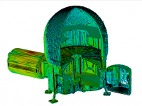
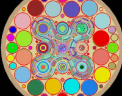

.. DAGMC master file, created by
   sphinx-quickstart on Fri Aug 31 10:08:00 2012.
   You can adapt this file completely to your liking, but it should at least
   contain the root `toctree` directive.

DAGMC: Direct Accelerated Geometry Monte Carlo
==============================================

The Direct Accelerated Geometry Monte Carlo (DAGMC) software package allows
users to perform Monte Carlo radiation transport directly on CAD models. The
DAGMC library, which contains the underlying ray tracing and geometry
operations, is a part of the Mesh-Oriented datABase (MOAB_) library. The main
DAGMC toolkit contains the functionality for coupling with physics codes as well
as other related tools.

.. raw:: html
   :file: slideshow.html

..  image:: gallery/iter_thumbnail.png
   :target: gallery.html
   :hidden:

..  image:: gallery/fnsf_thumbnail.png
   :target: gallery.html
   :hidden:

DAGMC is designed in a modular fashion so that it can be integrated into a
variety of Monte Carlo radiation codes. The CNERG_ research group at the
University of Wisconsin--Madison (UW) has historically focused on integration
with MCNP5_, but DAGMC has also been integrated into Geant4_, Fluka_, Tripoli4_,
and Shift_. There are also planned efforts to integrate DAGMC into other
packages such as MCNP6_, Serpent2_, OpenMC_, Phits_, and Frensie.

DAGMC currently relies on using the solid modeling software Trelis_ or Cubit_ to
prepare solid models. These packages can be used to import CAD models from other
tools such as SolidWorks, CATIA, etc., or to create geometry from scratch. DAGMC
also relies on Trelis/Cubit to assign materials and other geometry-related
information such as tallies and variance reduction parameters. Some knowledge of
the specific Monte Carlo application is necessary for other parameters such as
source definition and run control.

.. toctree::
   :maxdepth: 1

   install
   usersguide/index
   devguide/index
   upcoming

.. _CNERG: http://cnerg.github.io
.. _MOAB: http://press3.mcs.anl.gov/sigma/moab-library
.. _Cubit: https://cubit.sandia.gov
.. _Trelis: http://www.csimsoft.com/trelis
.. _MCNP5: https://mcnp.lanl.gov
.. _MCNP6: https://mcnp.lanl.gov
.. _Geant4: http://geant4.cern.ch
.. _Fluka: http://www.fluka.org/fluka.php
.. _Tripoli4: https://rsicc.ornl.gov/codes/ccc/ccc8/ccc-806.html
.. _Shift: http://web.ornl.gov/sci/nsed/rnsd/rt
.. _Serpent2: http://montecarlo.vtt.fi
.. _OpenMC: https://mit-crpg.github.io/openmc
.. _Phits: http://phits.jaea.go.jp
