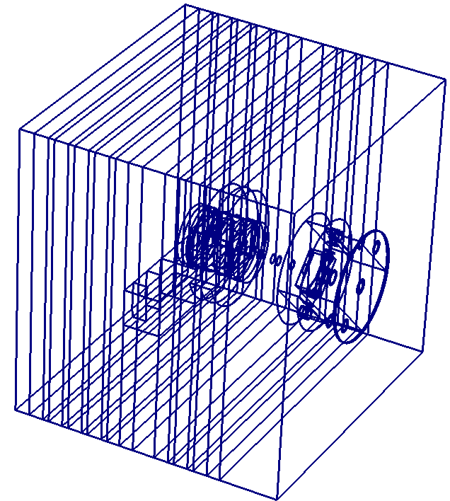
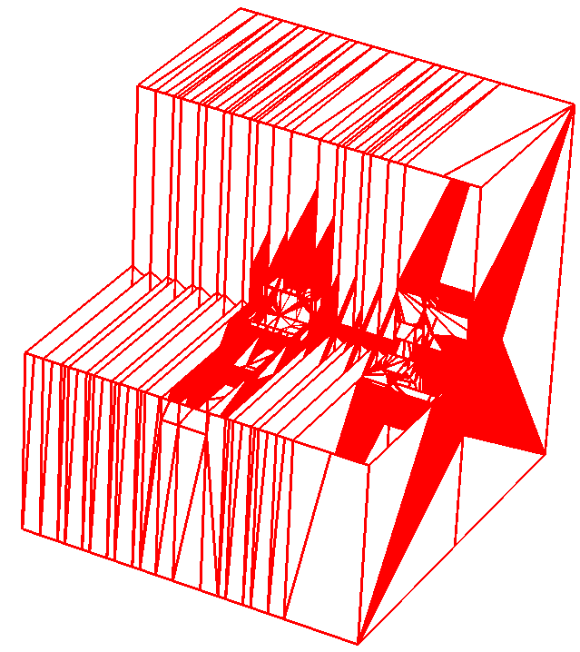

Post-processing
===============

One of the most important aspects of a completed calculation is being able to
view any mesh-based output alongside geometry so as to best determine important
features in results.

Visualizing DAGMC geometry
~~~~~~~~~~~~~~~~~~~~~~~~~~
In the near future there will be support for reading native MOAB-produced .h5m
files in VisIt_. However for now users must follow this guide for viewing DAGMC
geometry. One must use ``mbconvert`` to produce files for visualization. The
following command will convert the DAGMC geometry to a .stl file.
::

    $ mbconvert <dagmc.h5m> <dagmc.stl>

It is often the case that DAGMC models contain so many triangles that it is
prohibitively slow to plot such a model even in VisIt_ or Paraview_. In such
cases it has proven useful to extract the faceted curves from the file and plot
those. This can be achieved with the following commands:
::

    $ mbconvert -1 dagmc.h5m curves.h5m
    $ mbconvert curves.h5m curves.vtk

Note in the above example that one must first extract the curve information to a
new .h5m file, and then convert that file to a .vtk file. When plotting, the
curves that define the boundary of each volume should be visible. An example
of this is shown below; curves are shown on the left and facets on the right.

The .vtk file containing the curves is useful if you wish to examine the final
model in a convenient and graphically responsive method; however, one cannot
perform slice operations on the curve file. When plotting alongside mesh files,
the .stl file should be used as it can be sliced conviently. If the .stl file is
still prohibitively large, it is sometimes useful to generate a facet file with
higher tolerances purely for visualization purposes.

Visualizing DAGMC mesh tally output
~~~~~~~~~~~~~~~~~~~~~~~~~~~~~~~~~~~

There are number of ways that conventional MCNP cartesian meshtal files can be
viewed in VisIt_ or Paraview_. Users can download and install the
`PyNE toolkit <PyNE_>`_ and use the ``meshtal_to_mesh`` tool, or ``mbconvert``
can be used to convert meshtal files to h5m. Advanced DAGMC mesh tallies
(tetrahedral mesh tallies) are natively produced in .h5m file format. In either
case, the resultant cartesian or tetrahedral mesh tally must be converted from
.h5m to .vtk format. ``mbconvert`` can be used to convert the output mesh file
to a .vtk file for viewing or post-processing with VisIt or other plotting
tools.
::

    $ mbconvert mesh_out.h5m mesh_out.vtk

Having produced .stl files for slicing and .vtk files for mesh tallies, we can
load these files into VisIt_ or Paraview_, or any other tool that can read .stl
and .vtk files.

.. _VisIt: https://wci.llnl.gov/simulation/computer-codes/visit
.. _Paraview: http://www.paraview.org
.. _PyNE: http://pyne.io
