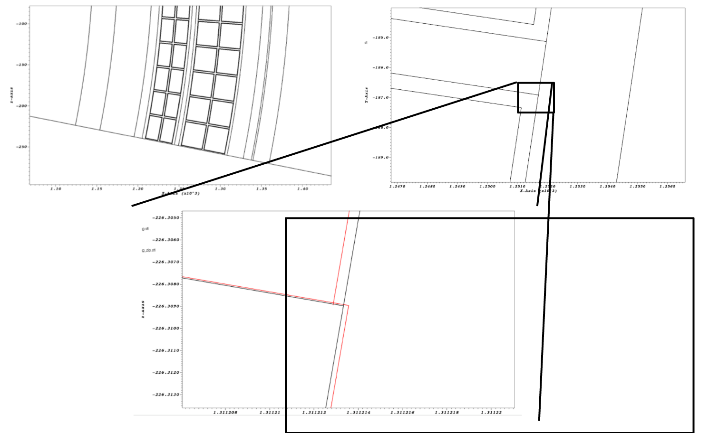
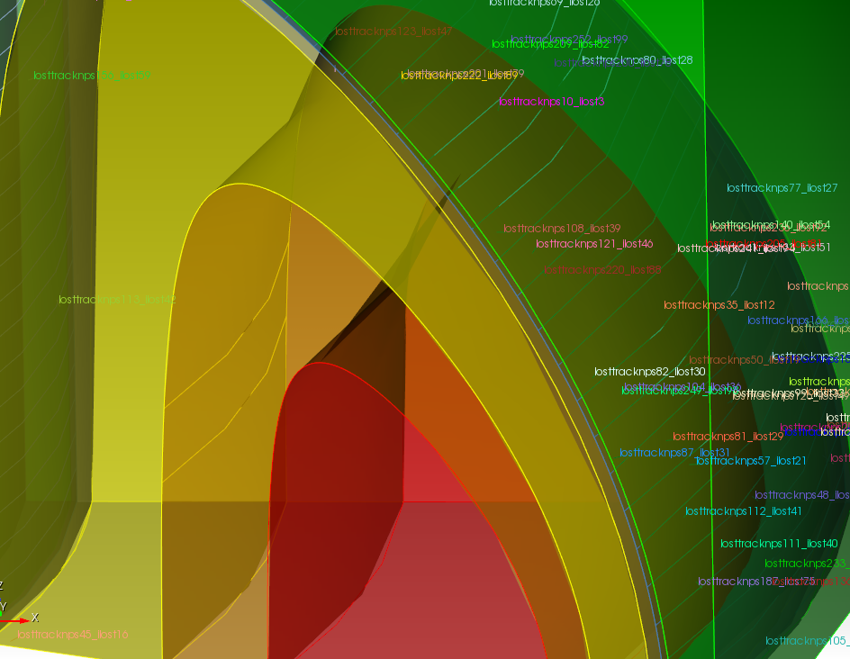
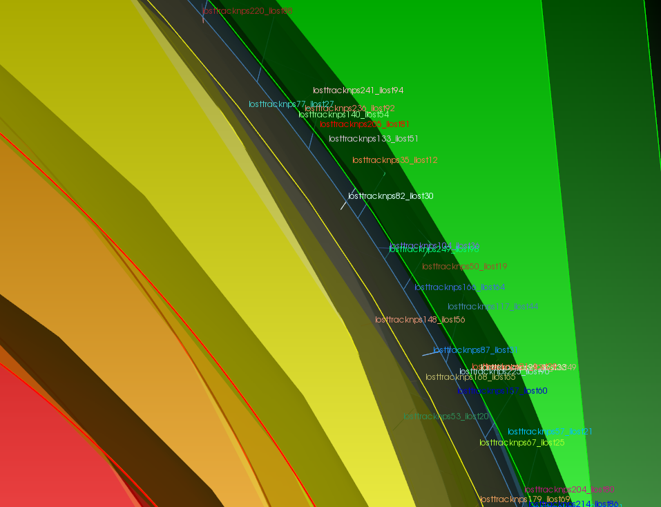

DAGMC tools
===========

The DAGMC infrastructure has a number of tools that are used to process, fix,
diagnose and repair processed models. This document serves to better inform and
educate what those tools are and how to use them.

..  _make_watertight:

make_watertight
~~~~~~~~~~~~~~~

A model is considered watertight if the faceting of all topologically linked
surfaces are coincident. Models produced by Cubit/Trelis are not guarenteed to
be watertight, and as a general rule, the more complicated the model, the less
likely it is to be completely watertight.

The ``make_watertight`` tool aims to fix any watertightness issues in a model by
using faceted curve information to seal triangle facets that meet on the same
curve. An example of its use is shown here: the red lines show the geometry
before ``make_watertight`` and the black lines show the geometry after its use.

          geometry before ``make_watertight`` and the black lines show the
          geometry after its use.

``make_watertight`` can be run with:
::

    $ make_wateright <filename>

The product will be a file named, `filename_zip.h5m`, and a summary is provided
of what operations were done to seal the model.

check_watertight
~~~~~~~~~~~~~~~~

The ``check_watertight`` tool can be used to find out how watertight a
given model is. It should be used as a post-processing step after
``make_watertight`` to verify that the model has been made more watertight.

``check_watertight`` can be run  with:
::

    $ check_wateright <filename>

Both ``make_watertight``and ``check_watertight`` are built during the main DAGMC
build procedure and can be found in DAGMC's `bin` directory.

mbconvert
~~~~~~~~~

The mbconvert tool is a MOAB tool used to translate MOAB meshes into some
text based format. It is useful for converting DAGMC models into some other
visualization form for result post processing, such as stl files for viewing in
Visit or Paraview. To run mbconvert input option, input filename and output
filename are specificed:
::

    $ mbconvert <input_filename> <output_filename> [options]

The options which control mbconvert are:
::

    -v  <int> - extract a specific volume or range of volumes
    -s  <int> - extract a specific surface or range of surfaces
    -c  <int> - extract a specific curve or range of curves
    -1  - extract edges only
    -2  - extract two dimensional entites only e.g. Tri, Quad, etc.
    -3  - extract three dimensional entities only, e.g. tet, hex, etc.
    -h  - print help
    -f  - list available read/write formats

mklostvis
~~~~~~~~~

Sometimes either poor quality CAD, incorrect imprinting & merging or overlapping
volumes; particles are regarded as lost by the Monte Carlo code. It is therefore
neccessary to be able to examine where the particles were lost and in which
direction they were travelling in. The tool mklostvis_ is designed for this
purpose, reading the output of the MCNP lost particle information and producing
a Cubit or journal file which will draw the lost particles as vertices and their
directions as curves. The script can be run with:
::

    $ mklostvis.pl [mcnp output filename] [vector length] > [journal file name]

The produced Cubit journal file can be "played", and will plot these lost
particles on top of whatever geometry is loaded into your Cubit session, like
that shown below.

..  _mklostvis: https://github.com/svalinn/meshtools/tree/master/lostparticles
