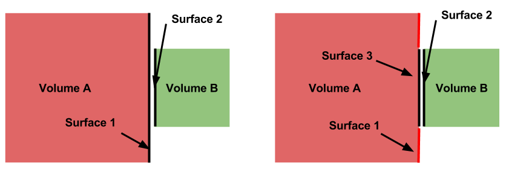
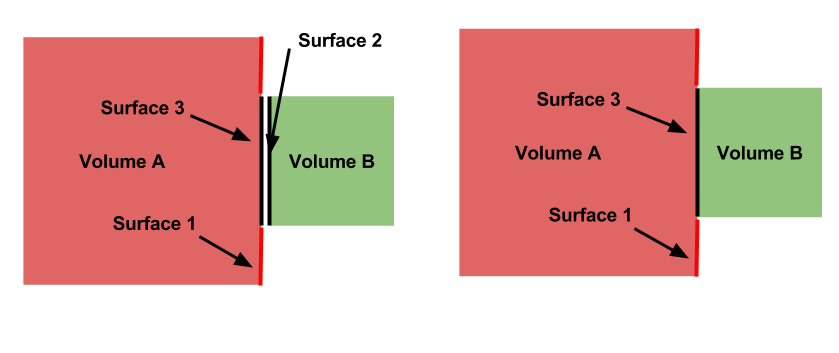
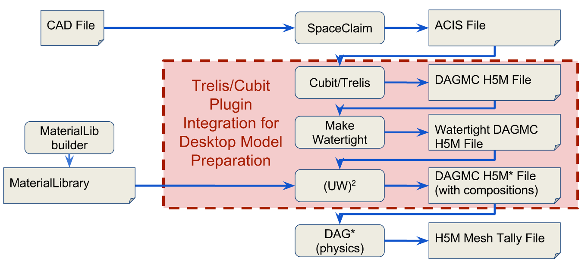

Cubit/Trelis basics
===================

Pre-processing solid models using Cubit/Trelis
~~~~~~~~~~~~~~~~~~~~~~~~~~~~~~~~~~~~~~~~~~~~~~

This section focuses on steps that are independent of the Monte Carlo code used
for analysis. Additional steps for the unified workflow, `UW2 <uw2.html>`_, or
`Monte Carlo code-specific workflows <codes/index.html>`_ may be followed as
needed.

Importing the solid model
-------------------------

The first step in Cubit/Trelis is to import the generated solid model. Depending
on the complexity of the model, this step can take several seconds up to a half
an hour. As an initial user, it is recommend to start with simple models and
geometries to obtain a better understanding of Cubit/Trelis.

Imprint and merge
-----------------

For a DAGMC based analysis to work optimally, all of the surfaces must be
imprinted and merged. Imprinting creates a common surface interface between
touching volumes. Merging then takes the touching surfaces and makes them into
one surface. The imprint operation is shown below.

To imprint, issue the following command:
::

    CUBIT> imprint body all

Should the imprint be successful, then the next step is to merge the geometry. A
schematic of what the merge operation achieves is shown below.

Sometimes it may be important to specify a merge tolerance. To set the tolerance
and merge, issue the following commands:
::

    CUBIT> merge tol 5e-7
    CUBIT> merge all

This process can be very time consuming. For large models of several thousand
volumes, the imprint and merge steps can take several hours. However, for small
geometries (on the order of 100 volumes) the process is rather quick.

..  _grouping-basics:

Grouping volumes and surfaces
-----------------------------

A DAGMC-based analysis allows a number of attributes of the geometry to be
defined within the geometry file. These characteristics generally relate to the
physical behavior of the volume, for example its material definition or boundary
conditions.

Before the discussion of specific attributes, the practice of "grouping" needs
to be explained. A group is essentially a collection of volumes or surfaces that
share a common attribute; the practical usage of "grouping" will be explained in
the next section.

The general format for creating/adding volumes to a group is:
::

    CUBIT> group "group.name" add vol/surf ...

For example, to create a group called "moderator" containing volumes 5, 6, 7,
and 10, the following command would be used:
::

    CUBIT> group "moderator" add vol 5 to 8 10

Another example, shows that groups don't have to just contain volumes, but can
contain surfaces too. Below the group "shield.boundary" is created with surfaces
16 and 37:
::

    CUBIT> group "shield.boundary" add surf 16 37

Due to the importance of using the ``group`` command reading the
`CUBIT manual <CUBIT_manual_>`_
section on its full usage is highly recommended.

.. _geom_production:

Production of the DAGMC geometry
--------------------------------

Now that the geometry is ready for DAGMC we must export it. Using the
Cubit/Trelis plugin make this very straightforward, assuming that the user has
proceeded through the previous steps then all one must do is use the export
dagmc command.
::

    CUBIT> export dagmc <filename> [faceting_tolerance <faceting tolerance>]
                                   [length_tolerance <length tolerance>]
                                   [normal_tolerance <normal tolerance>]
                                   [verbose] [fatal_on_curves]

The meaning of these different options are described below

**Faceting Tolerance** -  Specifies how far a facet is allowed
                          to be from the CAD representation of
                          a surface in the faceting algorithm.

**Lenth Tolerance** -     Specifies the maximum allowed length
                          of a facet edge.

**Normal Tolerance** -    Specifies the maximum allowed change
                          in angle between then normal vector
                          of two adjacent facets.

For example to produce a file called, geometry.h5m with faceting tolerances and
length tolerances of 1.0e-4 cm and 5.0 cm respectively
::

    CUBIT> export dagmc geometry.h5m faceting_tolerance 1.e-4 length_tolerance 5.0

The time taken to perform this step depends upon the complexity of the model, it
could  take seconds for very simple models to hours for very complex models. It
is also possible that faceting artifacts or failures could occur at this point,
so monitor the output of this command in the Cubit/Trelis command line. If
issues due occurs, these should be addressed following the workflow listed
above.

Where faceting_tolerance, normal_tolerance, and length tolerance are optional
arguments. For example, to export the currently loaded file to a file called
"large_facets.h5m" with a faceting tolerance of 1.e-5, use
::

    CUBIT> export dagmc "large_facets.h5m" faceting_tolerance 1.e-5

Roadmap for the future
~~~~~~~~~~~~~~~~~~~~~~

Currently we have a number of standalone command line tools that are run sequentially
on a model following faceting using Cubit/Trelis. We run `make_watertight` to seal
models to ensure no topological weaknesses exist and we run `uwuw_preproc` to add
materials into analysis geometries. It is envisioned that at some point in the
near future that we will integrate these as options within the Cubit/Trelis plugin.

This will allow you to add additional options if you want the model to be made
watertight and/or if you want to add materials to the resultant geometry. There will
always be power users that prefer the command line tools. These tools will continue
to be supported with identical infrastructure.

..  _CUBIT_manual: https://cubit.sandia.gov/public/15.2/help_manual/WebHelp/cubithelp.htm
