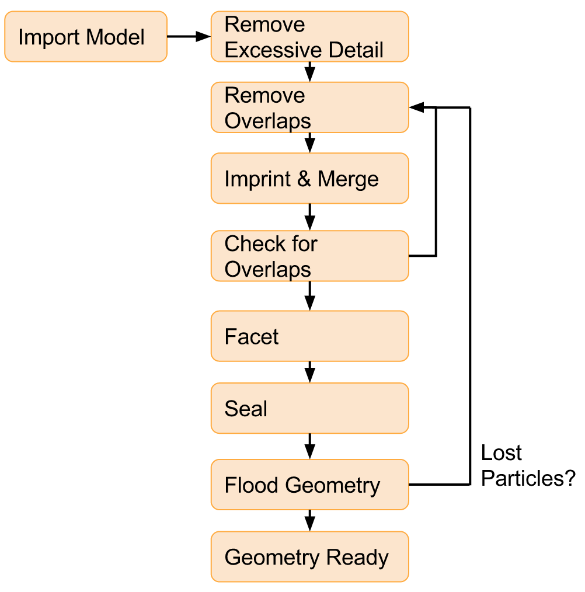

Producing solid models for DAGMC using Cubit/Trelis
===================================================

The general workflow for the production of models for analysis using DAGMC
looks like that shown in the Figure below.

The general workflow for the production of DAGMC models is the following:

1.  Ensure that units/sizes for DAGMC models are "cm"
2.  Remove excessive detail (typically threads on bolts, combine washer stacks, etc.)
3.  Inspect and resolve overlapping volumes, you may need to scale the model up 
    to detect these
    ::

        CUBIT> validate vol all
        CUBIT> autoheal problem vols

**Other tools:**

- Regularize may be needed (simplifies by removing splines, but will reverse imprint operation)
 
- Check and possibly remove negligibly small curves, surfaces, and volumes. (check "hydraulic" length and "regular" length)
    ::

        CUBIT> group "smallsurfaces" add surface with area < 1.e-3
        CUBIT> group "smallcurves" add curve with length < 1.e-4
        CUBIT> group "smallvols" add volume with volume < 1.e-5
       
4.  Create pre-imprint/merge table of volume of volumes, and then imprint
    ::

        CUBIT> imprint body all

5.  Merge model, in Cubit
    ::

        CUBIT> merge all

    You may also wish to add a merge tolerance (this must be done before merging)
    ::

        CUBIT> merge tol 1e-6

6.  Validate model, in Cubit 
    ::

        CUBIT> validate vol all

    - re-check for overlapping volumes and now also check for overlapping surfaces
    - create post imprint/merge table of volume of volumes (use volofvolcubit.py)
    - compare pre and post-imprint/merge model volume of volumes
    - inspect volumes in pre-imprint model with significant change in volume
    - re-check for small areas, curves, volumes
    - any problems in these steps repair volumes in pre-imprint model and go back to step 3
7.  Facet model
    ::

        CUBIT> export dagmc "geom.h5m" faceting_tolerance 1.0e-4

8.  Seal model if possible (use `make_watertight <tools.html#make-watertight>`_)
9.  Flood and/or transport particles in model
10. If lost particles or leaky:
    
    - examine lost locations (use `mklostvis.pl <tools.html#mklostvis>`_)
    - examine "leaks"/tunneling (can use a mesh tally to locate)
    - repair the pre-imprint/merge model (go to step 2)
11. If no lost particles or leaks, then the model is ready for transport

Preparing solid models
~~~~~~~~~~~~~~~~~~~~~~

In theory, solid models can be prepared in any modeling software
system (e.g. SolidWorks, Pro/E, Catia, etc).  What is most important
about the choice of solid modeling system is the ability to export to
a format that can be imported by Trelis or Cubit, in particular:

    * ACIS (\*.sat)
    * STEP (\*.stp, \*.step, etc)

The ACIS format is strongly recommended due to its ability to retain imprint and
merge information, and there is anecdotal evidence that ACIS files 
lead to a more successful model pipeline. Ansys Spaceclaim is often used at UW - Madison
to perform model cleaning and defeaturing, which can import many of the common
CAD formats and exports to ACIS.

There are a number of concepts to consider while preparing a solid
model; however, the most important considerations are small gaps and
overlaps that might exist in the model. These gaps and overlaps can
lead to rapid failure when running a DAGMC-based analysis. The
following steps are provided to help make a more robust model *before*
running your DAGMC-based analysis.

Beware: obtaining a robust model may be an iterative and time
consuming process. In some cases, the validity of the model will
require running a DAGMC-based analysis and assessing whether or not
the model yielded expected results or a small enough number of lost
particles. If the results did not meet expectations, changes to the
model may be in order.

Knowing the model
-----------------

The first consideration to address is where the solid model originated
and for what purpose. In many instances, models constructed for
manufacturing purposes will have tolerances that are undesirable for
particle transport applications. For example, a gap might exist
between fuel pellets and the cladding wall for a PWR fuel rod. While
this is perfectly acceptable for an individual manufacturing the rod,
the gap could potentially present problems in a DAGMC-based
analysis, depending on how it is modeled.

Knowing who created the model and to what purpose provides a starting
point for preparing the model. If it was made with particle transport
in mind, then very little work may be needed; but as with the example
above, some models may require changes to accommodate the needs of a
DAGMC-based analysis.

Identifying weaknesses in the model
-----------------------------------

When assessing a model that is to be used for particle transport two
primary concerns must addressed. These concerns are:

    * Gaps
    * Overlaps

Gaps occur when the surfaces of two volumes/parts that should be in
contact are set apart from each instead of having coincident
surfaces. The size of the gap is generally unimportant, for most solid
modeling programs, a gap is a gap. The desired result is to have all
surfaces of volumes/parts to be coincident. If coincidence is not
achieved, particles may become lost when entering the region between
the surfaces.

Overlaps are found where two or more volumes/parts encroach upon the
same space. As with gaps, the magnitude of the overlapping volume is
usually unimportant.  When a particle enters a region of overlap, it
may not correctly determine which volume/part it resides in. If this
occurs, the particle may become lost.

Identifying gaps and overlaps may be difficult and time consuming;
however, some 3D modeling programs like SolidWorks have built in tools
to identify these occurrences. Rely on the modeling program to
identify these problematic features and use the steps in the
next section to change, reduce and remove their effect on the model.

Modifying your model
--------------------

Once the gaps and overlaps in the model have been identified, the
three following methods may be used to change, reduce, and remove their
effect on the model.

* Create "voided" geometries
* Modify volume/part dimensions
* Remove superfluous details

Each method is discussed in detail below:

As with the fuel rod example mentioned above, some regions that are
'gaps' are also important. Instead of removing the gap entirely (by
changing the dimensions of the cladding or the fuel to force
coincidence), a new volume/part could be modeled that coincided with
the outer diameter of the fuel AND the inner diameter of the
cladding. Now a "voided" geometry occupies the previously unaccounted
for region. By specifying these "voided" geometries in a DAGMC-based
analysis, the physical importance of the region can be retained while
accomodating the requirement of having coincident surfaces.

Another method to resolve gaps and overlaps is to simply change the
dimensions of the volume/part (eg: making a dimension several cm
bigger or smaller to ensure coincidence surfaces). In many instances
this method could compromise the physics of the solution and is then
undesirable. However, in other instances, this solution is very
logical. One particularly significant example is if different volumes
were modeled with different unit systems. For example, one volume/part
might have been model in [in] while its neighbor was modeled in [cm].
While surfaces may be nearly coincident, rounding errors might
prevent coincidence from occurring. A simple change to one dimension
may hardly change the volume/part's characteristics yet result in
coincidence.

Finally, superfluous details may prevent a volume/part from coinciding
with its neighbors properly. A potential solution is to simply remove
the superfluous detail to simplfy the model and ensure the desired
surfaces are coincident. Some volumes/parts will inherently hurt the
model's effectiveness either due to its complex features or small
dimensions. A volume/part's effect on the model cannot truly be
assessed until a DAGMC-based analysis is run. This final method is
usually implemented in an attempt to reduce the number of lost particles
while maintaining the most important characteristics of the system.

*Note: Of all steps, the removal of superfluous details is the most
subjective and heavily dependent on the model's intended
application.*

Assessing your model
--------------------

Lost particles are undesirable; lost particles usually indicate
weaknesses and failures within the geometry. While the goal of the
DAGMC project is to guarantee that there will never be lost particles,
they can occur even on robust geometries.  It is up to the
user/analyst to determine what lost particle rate they consider
acceptable.  The UW-Madison group usually considers lost particle
rates that are less than 1/5,000,000 to be a threshold for most problems.
It is important to understand whether particles are being lost from an
important region of your phase space.

The implicit compliment is automatically generated by DAGMC upon loading a geometry;
it is composed of all the space that is not defined by the CAD geometry. It is often
convenient to not define all space in a given model, for example the space inside a
tokamak which is occupied by air or vacuum, or the water volume in a reactor. The
power of the implicit compliment lies in the fact that it is not a true CAD body
since it was never defined, but it automatically defines all undefined space in the model.

Finishing up and final notes
----------------------------
Having prepared your model to completion with the appropriate groups created
, you can choose to save your model in various formats. Previously 
we recommended ACIS \*.sat files, but any format that reliably retains
imprortant metadata will suffice.  Recommended storage formats are ACIS, \*.Trelis or 
\*.cub files.

One should also use the :ref:`make_watertight`. tool on the 
produced DAGMC \*.h5m file in order to completely seal your geometry, this 
should help prevent tolerance issues due to faceting.
