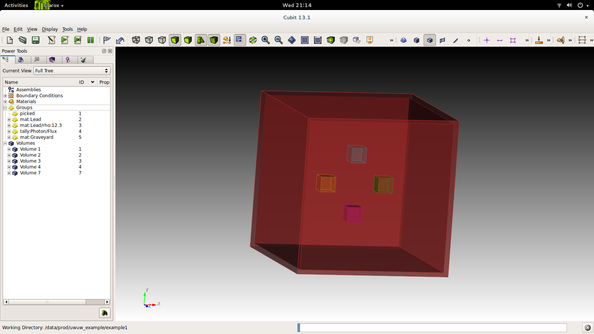

University of Wisconsin Unified Workflow (UWUW)
===============================================

..  |UW2| replace:: UW\ :sup:`2`

The University of Wisconsin Unified Workflow (|UW2|) aims to solve the
issue of running the same Monte Carlo problem using mutiple physics codes. Currently,
if you wish to run the same problem in multiple codes you must fully recreate the
input deck for each code, or maybe write a full syntax translator. |UW2| allows users
to tag or associate groups of volumes or surfaces with a simple human readable syntax
that is translated and stored in the geometry file of a DAGMC problem.

The workflow uses the Python for Nuclear Engineering toolkit, `PyNE <http://pyne.io>`_. We
levereage the existing infrastructure in PyNE to allow a consistent transport problem to be
defined across all MC codes.

Materials
~~~~~~~~~

Materials are the most painful and error prone items to transfer from code to code, since each MC code
specifies materials in a different way. Instead, we tag groups of volumes
with a name and syntax that corresponds to material compositions in a predefined
material library.

The group naming syntax for describing materials in Cubit/Trelis is:
::

    CUBIT> group "mat:<Name of Material>"

If you wish to specify a material that is present in the library with a different
density, then
::

    CUBIT> group "mat:<Name of Material>/rho:<density>"

So for example, to specify a Stainless Steel at a density of 12.0 g/cc,
::

    CUBIT> group "mat:Stainless Steel/rho:12.0"

Scoring
~~~~~~~

Each MC code implements tallies, or scores, in very specific ways such that there
is sometimes no equivalent to a tally you may be familiar with, code to code. However,
there is a Cubit syntax to allow you to request scores on geomemtric elments, the generic form is,
::

    CUBIT> group "tally:ParticleName/ScoreType" add vol x

A specific example, scoring the neutron flux in vol 2,
::

    CUBIT> group "tally:Neutron/Flux" add vol 2

or the photon current crossing surface 3,
::

    CUBIT> group "tally:Photon/Current" add surface 3

Using the underlying PyNE libraries we can write out the appropriate MC code
tally specification snippet; this allows the number of codes the DAGMC
supports to grow organically with those that PyNE supports. When PyNE cannot
fulfill your tally request it will warn you.

Boundary conditions
~~~~~~~~~~~~~~~~~~~

All MC codes have an understanding of boundary conditions, and all at least
implement some form of Graveyard, Blackhole or some region where particles are
'killed'. Some MC codes go further and define reflecting or other boundary
conditions; furthermore some apply these boundary conditions to entire Volumes
as opposed to Surfaces.  Currently we support only reflecting surface
definitions, but in the near term we hope to support full volume reflecting
boundaries. One can implement reflecting surfaces in |UW2| by adding surfaces
to the following Cubit group defintion
::

    CUBIT> group "boundary:Reflecting"

or if you prefer, Lambert (white reflection)
::

    CUBIT> group "boundary:White"

Particle importances
~~~~~~~~~~~~~~~~~~~~

Particle importances are in important aspect of Monte Carlo simulations and
are used to help particles to penetrate to "important" regions of the geometry.
There are several automatic methods to generate mesh based importances or weights,
but if your importances are tried to the geometry, then this can be tagged onto
the geometry.

The |UW2| workflow has a code agnostic way of defining importances.
::

    CUBIT> group "importance:Neutron/1.0"

This is translated to the code specific version at runtime. *Note: Fluka's importance
range runs from 1e-5 to 1e5, when written to file, the range is rescaled and any out of
range values are truncated to 1e-5 and 1e5.*

|UW2| data
~~~~~~~~~~

The |UW2| data is incorporated into the geometry file (\*.h5m) file using a
C++ program, uwuw_preproc, the purpose of which is to take the user's
material library, e.g. my_nuc_library.h5, and extract the materials requested,
placing them into the geometry file. Having already marked up your geometry
using the methods mentioned in previous sections, we can run the preprocessor
::

    $ uwuw_preproc <dagmc h5m filename> -v -l <path to nuclear data library>

Be sure to examine the output of this script which will inform you of the
materials and densities requested and also the list of tallies that were
produced. A sample output is shown below
::

    $ uwuw_preproc test_geom.h5m -l \
          $HOME/.local/lib/python2.7/site-packages/pyne/nuc_data.h5

Also, the program will produce a fatal error if the material is not found in
the material library. There is a simulate mode (flag -s) to perform all operations
that would be performed on a normal operation, with the exception that no data
is actually written, this can be done to test your file to make sure all the expected
materials are present in the file.

MCNP-specific steps
~~~~~~~~~~~~~~~~~~~

..  include:: codes/dag-mcnp5_specific.txt

FluDAG-specific steps
~~~~~~~~~~~~~~~~~~~~~

To run a FluDAG based UWUW problem, like the above MCNP example, the user must make a minmal Fluka input deck
defining runtime parameters, source definition, remembering to include the GEOBEGIN keyword set to FLUGG. 
Once this is done run the mainfludag executable to produce the mat.inp which contains all the detailed 
material assignments and compound descriptions;
::

    $ mainfludag geom.h5m

The user then should paste the contents of the mat.inp into the main Fluka input deck. Now the user must make
a symbolic link to the geometry file named dagmc.h5m
::

    $ ln -s geom.h5m dagmc.h5m

The mainfludag executable always looks for the dagmc.h5m file. You can now run as if it were a standard
Fluka problem
::

    $ $FLUPRO/flutil/rfluka -N0 -M5 -e mainfludag input.inp

Geant4-specific steps
~~~~~~~~~~~~~~~~~~~~~
To run a Geant4 problem, like those shown above, the user must write a Geant4 macro file that contains at
minimum, only the source description (GPS) and the number of particles to simulate. The problem is then run with
::

    $ DagGeant geom.h5m input.mac

Worked example
~~~~~~~~~~~~~~

Open Trelis/Cubit, and let's place some volumes to create our first problem.  We will
create 4 cubes of side 10 cm, shifting each in a different direction
::

    CUBIT> brick x 10
    CUBIT> move Volume 1 x 20 include_merged
    CUBIT> group "mat:Lead" add volume 1
    CUBIT> group "tally:Photon/Flux" add volume 1
    CUBIT> brick x 10
    CUBIT> move Volume 2 x -20 include_merged
    CUBIT> group "mat:Lead" add volume 2
    CUBIT> group "tally:Photon/Flux" add volume 2
    CUBIT> brick x 10
    CUBIT> move Volume 3 y -20 include_merged
    CUBIT> group "mat:Lead/rho:12.3" add volume 3
    CUBIT> group "tally:Photon/Flux" add volume 3
    CUBIT> brick x 10
    CUBIT> move Volume 4 y 20 include_merged
    CUBIT> group "mat:Lead/rho:12.3" add volume 4
    CUBIT> group "tally:Photon/Flux" add volume 4
    CUBIT> brick x 100
    CUBIT> brick x 105
    CUBIT> subtract volume 5 from volume 6
    CUBIT> group "mat:Graveyard" add volume 7
    CUBIT> imprint body all
    CUBIT> merge all
    CUBIT> set attribute on
    CUBIT> export acis "example.sat" overwrite

You will end up with something like that shown below.

The file is now ready for preprocessing. First we must facet the file:
::

    $ dagmc_preproc example.sat -o example.h5m

Now we can insert all the material data we need:
::

    $ uwuw_preproc example.h5m -l \
          $HOME/.local/lib/python2.7/site-packages/pyne/nuc_data.h5

Your output from this step should look exactly the same as below
::

    Making new material with name      : mat:Lead
                     with fluka_name:     LEAD
    Making new material with name      : mat:Lead/rho:12.3
                     with fluka_name:    LEAD1
    Photon PHFL1 3
    Photon PHFL2 3
    Photon PHFL3 3
    Photon PHFL4 3
    writing material, mat:Leadwriting material,     LEAD to file example.h5m
    writing material, mat:Lead/rho:12.3writing material,    LEAD1 to file example.h5m
    Writing tally PHFL1 to file example.h5m
    Writing tally PHFL2 to file example.h5m
    Writing tally PHFL3 to file example.h5m
    Writing tally PHFL4 to file example.h5m

So we see echoed back to us that we requested a Graveyard and two different
material assignments: one for Lead, as defined in the material library, and
another kind of Lead at a different density than the library version. We
also see that 4 tallies were requested: the photon flux in each volume.

Example input
~~~~~~~~~~~~~

We are now ready to run, once we have made the input deck for each Monte Carlo
code. We wish to launch 10^5 particles from a point source located at 0 0 0,
with isotropic angular behaviour for photons of 1 MeV. The input for MCNP and
FLUKA are shown below.

MCNP example: let us call this mcnp.inp
::

    example of UWUW
    c notice no cell cards
    c notice no surface cards
    c notice no blank lines!
    sdef x=0.0 y=0.0 z=0.0 par=2 erg=1.0
    c notice no materials
    c notice no tallies
    mode p
    nps 1e5
    print

Fluka example: let us called this fluka.inp
::

    TITLE
    * Set the defaults for precision simulations
    DEFAULTS                                                              PRECISIO
    * Define the beam characteristics
    BEAM          -0.001             10000.0                              PHOTON
    * Define the beam position
    BEAMPOS           0.        0.        0.
    * Notice the FLUGG section
    GEOBEGIN                                                              FLUGG
    GEOEND
    * notice no material assignments
    * notice no scoring assignments
    * ..+....1....+....2....+....3....+....4....+....5....+....6....+....7...
    RANDOMIZ         1.0
    * Set the number of primary histories to be simulated in the run
    EMF
    START           1.E5
    STOP

MCNP run
~~~~~~~~

Now we are ready to run the first DAG-MCNP5 example:
::

    $ mcnp5 i=mcnp.inp g=example.h5m

You should see the following on screen
::

    The implicit complement's total surface area = 128550
    This problem is using DAGMC version    1.000 w/ DagMC r   0
    Using default writer WriteHDF5 for file fcad
    /mnt/data/prod/uwuw_example/web_example/example.h5m
    Materials present in the h5m file
    mat:Lead
    mat:Lead/rho:12.3
    Tallies present in the h5m file
    PHFLUX1
    PHFLUX2
    PHFLUX3
    PHFLUX4
    Going to write an lcad file = lcad
    Tallies
              Thread Name & Version = MCNP5, 1.60
              Copyright LANS/LANL/DOE - see output file
                                      _
                ._ _    _  ._   ._   |_
                | | |  (_  | |  |_)   _)
                                |

    comment.  photon   importances have been set equal to 1.
    comment. using random number generator  1, initial seed = 19073486328125
    Turned OFF ray firing on full CAD model.
    Set overlap thickness = 0
    imcn   is done

     warning.  material        1 has been set to a conductor.
     warning.  material        2 has been set to a conductor.

                               ctm =        0.00   nrn =                 0
    dump    1 on file runtpe   nps =           0   coll =                0
      xact   is done

    cp0 =   0.01
    run terminated when      100000  particle histories were done.

                                 ctm =        0.05   nrn =            900033
    dump    2 on file runtpe   nps =      100000   coll =            56221
    mcrun  is done

Feel free to examine the output of the run, but this provides a simple example on what to
expect.

FluDAG run
~~~~~~~~~~

For FluDAG, first we produce the mat.inp snippet file: this must then be pasted into
the full Fluka input deck
::

    $ mainfludag example.h5m

The mat.inp file should look like
::

    *...+....1....+....2....+....3....+....4....+....5....+....6....+....7...
    ASSIGNMA       LEAD1        1.
    ASSIGNMA       LEAD1        2.
    ASSIGNMA       LEAD2        3.
    ASSIGNMA       LEAD2        4.
    ASSIGNMA    BLCKHOLE        5.
    ASSIGNMA      VACUUM        6.
    *...+....1....+....2....+....3....+....4....+....5....+....6....+....7...
    MATERIAL         82.   207.217     11.35       26.                    LEAD1
    MATERIAL         82.   207.217      12.3       27.                    LEAD2
    *...+....1....+....2....+....3....+....4....+....5....+....6....+....7...
    * UW**2 tallies
    * PHFLUX1
    USRTRACK         1.0    PHOTON       -21        1.1.0000e+03     1000.PHFLUX1
    USRTRACK       10.E1     1.E-3                                               &
    * PHFLUX2
    USRTRACK         1.0    PHOTON       -21        2.1.0000e+03     1000.PHFLUX2
    USRTRACK       10.E1     1.E-3                                               &
    * PHFLUX3
    USRTRACK         1.0    PHOTON       -21        3.1.0000e+03     1000.PHFLUX3
    USRTRACK       10.E1     1.E-3                                               &
    * PHFLUX4
    USRTRACK         1.0    PHOTON       -21        4.1.0000e+03     1000.PHFLUX4
    USRTRACK       10.E1     1.E-3                                               &

At this point you will need to add two lines to the input file manually. This is
because the component of the code which identifies neutron cross section data is
not yet complete.
::

    *...+....1....+....2....+....3....+....4....+....5....+....6....+....7....+....
    LOW-MAT        LEAD1       82.       -2.      296.                    LEAD
    LOW-MAT        LEAD2       82.       -2.      296.                    LEAD

The lines above must be pasted into the Fluka input and then run as you would
any Fluka, with the exception that we give the rfluka script an executable
argument and a new "-d" argument, which specifies the geometry filename:
::
<<<<<<< HEAD
   %> $FLUPRO/flutil/rfluka -N0 -M1 -e /path/to/mainfludag -d example.h5m fluka.inp
=======
>>>>>>> master

    $ $FLUPRO/flutil/rfluka -N0 -M1 -e mainfludag -d example.h5m fluka.inp

The code should run and successfully produce screen output similar to the
following (the filepaths will change according to your system, as will the
numerical part of "fluka_26362"):
::

    $TARGET_MACHINE = Linux
    $FLUPRO = /mnt/data/opt/fluka/fluka/

    Initial seed already existing
    Running fluka in /mnt/data/prod/uwuw_example/web_example/fluka_26362

    ======================= Running FLUKA for cycle # 1 =======================

    Removing links
    Removing temporary files
    Saving output and random number seed
    Saving additional files generated
    Moving fort.21 to /mnt/data/prod/uwuw_example/web_example/fluka001_fort.21
    End of FLUKA run

Dag-Geant4 run
~~~~~~~~~~~~~~

DagGeant4 is probably the most trivial of all the |UW2| enabled codes to run.
Copy the vis.mac file from DAGMC/geant4/build/vis.mac
::

    $ DagGeant4 example.h5m

After some loading you should see a GUI window open (if you build geant4 with
visualisation on).  We can then use the Geant4 general particle
source to emulate the behaviour of the previous two codes:
::

    Idle> /gps/particle gamma
    Idle> /gps/ang/type iso
    Idle> /gps/energy 1.0 MeV

Now we are ready to run:
::

    Idle> /run/beamOn 1000000
