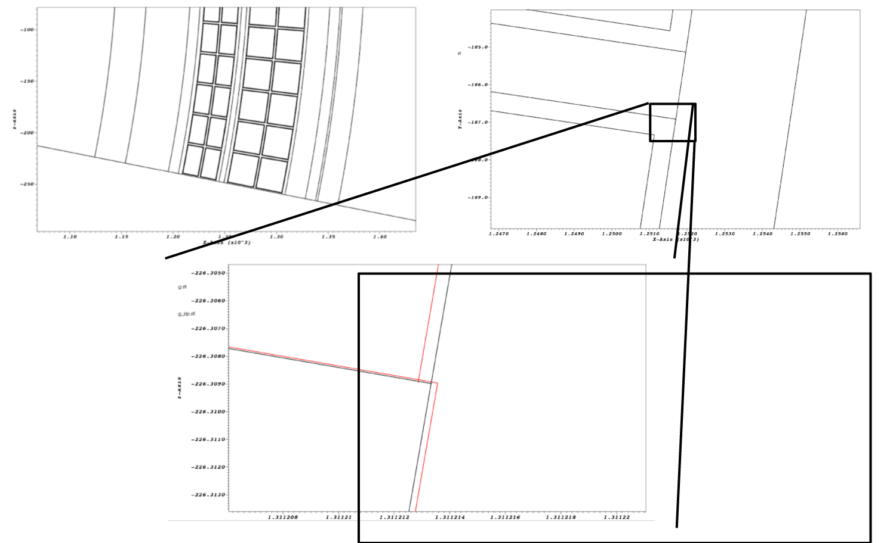

Watertightness
==============

A model is considered watertight if the faceting of all topologically linked
surfaces are coincident. Models produced by Cubit/Trelis are not guarenteed to
be watertight, and as a general rule, the more complicated the model, the less
likely it is to be completely watertight.

make_watertight
~~~~~~~~~~~~~~~

The ``make_watertight`` tool aims to fix any watertightness issues in a model by
using faceted curve information to seal triangle facets that meet on the same
curve. An example of its use is shown here: the red lines show the geometry
before ``make_watertight`` and the black lines show the geometry after its use.

         geometry before ``make_watertight`` and the black lines show the
         geometry after its use.

``make_watertight`` can be run simply with

    $ make_wateright <filename>

check_watertight
~~~~~~~~~~~~~~~~

The ``check_watertight`` tool can be used to find out how watertight (or not) a
given model is. It should be used as a post-processing step after
``make_watertight`` to verify that the model has been made more watertight.

``check_watertight`` can be run simply with

    $ check_wateright <filename>

Both ``make_watertight``and ``check_watertight`` are built during the main DAGMC
build procedure.
