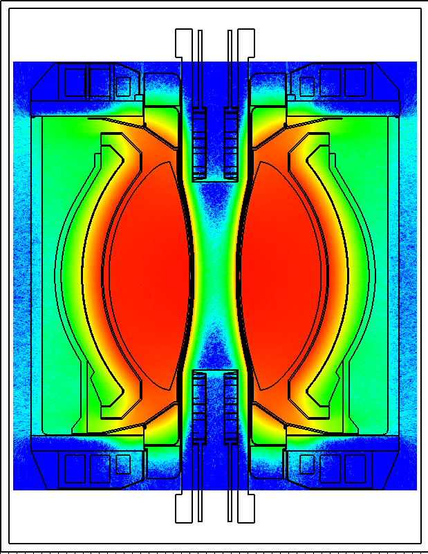

Gallery
=======

Below is an array of analysis results produced using DAGMC.

----

..  figure:: hab1.png
    :align: center

    NASA habitat module irradiated by 1 GeV protons, FluDAG

----

    PPPL Fusion Nuclear Science Facility (FNSF)

----

..  figure:: atr.png
    :align: center

    Advanced Test Reactor (ATR) cross section

----

    Proton flux in Spallation Neutron Source (SNS), DAG-MCNP6

----

..  figure:: bsm_work.png
    :align: center
    :scale: 45

    Fusion system blanket shield module, DAG-MCNP5

----

..  figure:: fng_sdr_fluka.png
    :align: center

    Frascati Neutron Generator (FNG) SDR geometry, FluDAG

----

..  figure:: fludag_ni_proton_mag.png
    :align: center

    Protons being deflected by magnetic field, interacting on nickel block, FluDAG

----

..  figure:: hab_module_proton_daggeant4.png
    :align: center

    Proton irradiation of NASA habitat module, DagGeant4

----

    Nuclear heating behind the ITER blanket modules including the presence of ELM coils, DAG-MCNP5

----

    Tritium reaction rate in PPPL ST-FSNF, DAG-MCNP5

----

    Neutron flux in FNG SDR geometry, DAG-MCNP5