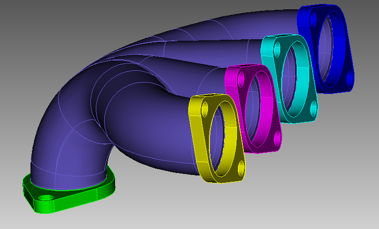

.. Double-Down documentation master file, created by
   sphinx-quickstart on Fri Mar 26 13:29:08 2021.
   You can adapt this file completely to your liking, but it should at least
   contain the root `toctree` directive.

DAGMC:  The Direct Accelerated Geometry Monte Carlo Toolkit
===========================================================

DAGMC is a toolkit for performing Monte Carlo radiation transport simulations on
CAD-based geometry models. It is built on top of the MOAB mesh database. DAGMC
is developed and maintained by the Computationan Nuclear Engineering Research
Group (CNERG) at the University of Wisconsin -- Madison.

.. toctree::
   :maxdepth: 2
   :caption: Contents:

Table of Contents
=================

.. toctree::
    :maxdepth: 2

    self
    usersguide/index
    developerguide/index
    api/index
